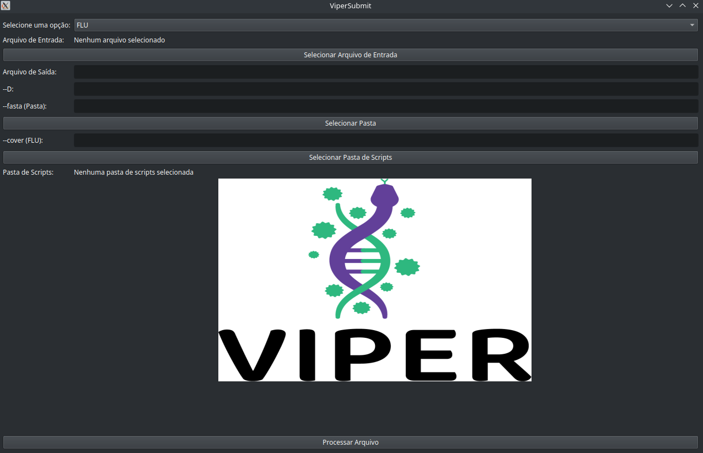

<details open>
  <summary>README</summary>
  
  ## GISAID Submission Method
  
  This repository contains scripts for the GISAID submission of Influenza viruses (H1N1, H3N2, Vic/Yamagata), Dengue (DENV), and SARS-CoV-2 (COV).
  
  ### Files in the Code Folder
  
  You can download the desired script by navigating to the CODE tab and clicking the download button in the upper right corner.
  
  ## Usage and Installation Guide
  
  ### Requirements to Run the Script:
  - The script for the desired virus.
  - An edited CSV as provided in the example (if possible, edit the example file with your data).
  - Python 3.
  - Pandas and biopython
  
  ### Installation Steps:
  
  1. **Install and Update the package list (required libraries), use the following commands:**
     ```sh
     sudo apt-get update
     sudo apt-get install python3
     sudo apt-get install python3-pip python3-venv
     python3 -m venv myenv  # Replace 'myenv' with your virtual environment name
     source myenv/bin/activate
     myenv\Scripts\activate  # Use this line if you're on Windows
     pip install pandas biopython openpyxl
     ```
     After the environment is created, a folder named after the environment (in this example, 'myenv') will also be created with all the necessary documents. In my case, I named an environment as 'sub' as shown in Figure 1 and Figure 2.
  
  <p align="center">
    
    <br />
    <span>Figure 1: Description of the first image.</span>
    <br /><br />
    
    <br />
    <span>Figure 2: Description of the second image.</span>
  </p>
  
  Make sure that the folders have been created correctly. You now have an environment set up to run the script.
  
  To activate the environment, use the terminal. For example, if you named the environment 'myenv', you should see the environment name next to the username/computer name in the terminal prompt. Ensure you activate the environment before running the script.
  
  <p align="center">
    
    <br />
    <span>Figure 3: Description of the third image.</span>
  </p>
  
  **Recommendations:**
  
  - **Consistent Folder Usage:** Always run the scripts in the same folder to ensure that the log file is continuously updated. Running the script in a new folder will create a new log file.
  
  - **Dedicated Folder:**
    - Create a dedicated folder for running the scripts.
    - The script processes all FASTA files related to the CSV input and generates a final FASTA file.
    - To avoid accidental deletion of the final FASTA file, move it to a separate folder after it is generated.
    - The script stores all intermediate FASTA files in the working folder and deletes them after use.
    - To maintain better code functionality and data safety, **always move the final FASTA files** to a different folder (e.g., `final_files`).
  
  - **Supplementary Files:**
    - In the `Supplementary_files` folder, you will find example CSV and FASTA files with the required columns for running each script.
    - Use these examples to ensure the script works correctly.
    - Fill in the data according to the guide provided for each script.
  
  - **FASTA Folder:**
    - Create a specific folder for the FASTA files.
    - This will simplify the script’s task of locating the FASTA files, as demonstrated in the provided example.

</details>

  Please follow the README file below for the specific virus

<details>
  <summary>README_FLU for Influenza:</summary>
  <br />
  
This README provides an overview of the data columns required to run the script. In the `Supplementary_files`, there is an example of how each column should be filled out for the script execution. Below is the description of each column:

**Requirements for the CSV to Run the Influenza Script:** 

- **ID:** Sample ID
- **Genome:** The name of the FASTA file
- **Type:** Flu type (A or B)
- **Subtype:** The subtype of the flu (H1N1, H3N2, Victoria, or Yamagata)
- **REQUESTING_STATE:** Your state
- **Segment_1_Coverage:** Coverage of segment 1
- **Segment_2_Coverage:** Coverage of segment 2
- **Segment_3_Coverage:** Coverage of segment 3
- **Segment_4_Coverage:** Coverage of segment 4
- **Segment_5_Coverage:** Coverage of segment 5
- **Segment_6_Coverage:** Coverage of segment 6
- **Segment_7_Coverage:** Coverage of segment 7
- **Segment_8_Coverage:** Coverage of segment 8
- **REQUESTING_UNIT:** Name of your unit
- **Collection_Date:** Collection date
- **Authors:** Name of the authors (please follow the example)

To execute the influenza scripts, use the command below: <br />
> _Don’t forget to activate the conda environment_

 ```sh
   python3 subGisaid_FLU.py --input  --output  --D --fasta  --cover
```

  --input: The CSV file with your data <br />
  --output: Name of the output file <br />
  --D: Number of the dynamic <br />
  --fasta: Path to the folder with FASTA files <br />
  --cover: Percentage of coverage of segments you want <br />

Exemple: 


  

The output of the script includes one log file, one FASTA file with formatted headers, and one XLSX file ready for submission to GISAID.


NOTE: The header of the FASTA file NEEDS to be the SAME as the content in the Genome column. Please verify this.

Example: If the Genome column contains "EPI_ISL_00097", the FASTA header should be "EPI_ISL_00097".


</details>


<details>
  <summary>Readme_COV for SARS-CoV-:</summary>
  <br />

Explanations


This README provides an overview of the data columns required to run the script. In the `Supplementary_files`, there is an example of how each column should be filled out for the script execution. Below is the description of each column:
Data Columns

  - **ID:** Sample ID
  - **Genome:** The name of the FASTA file
  -  **Pangolin_lineage:** Lineage of pangolin
  -  **Clade:**  Number of the clade
  -  **REQUESTING_UNIT:** The name of your laboratory
  -  **State:** Your state
  -  **Abbreviations:** Abbreviation of your state
  -  **Collection_Date:** Collection date
  -  **REQUESTING_SEQ:** Laboratory that sequenced the sample
  -  **Authors:** Names of the authors (please follow the example)
  -  **Country:** Your country
  -  **Continent:** Your continent
ssh'''
 python3 subGisaid_FLU.py --input  --output  --D --fasta 

  '''
  Script Arguments
  
  
     
  ```sh
   python3 subGisaid_FLU.py --input  --output  --D --fasta  --cover
  ```

  --input: The CSV file with your data <br />
  --output: Name of the output file <br />
  --D: Number of the dynamic <br />
  --fasta: Path to the folder with FASTA files <br />

The output of the script includes one log file, one FASTA file with formatted headers, and one XLSX file ready for submission to GISAID.


NOTE: The header of the FASTA file NEEDS to be the SAME as the content in the Genome column. Please verify this.

Example: If the Genome column contains "EPI_ISL_00097", the FASTA header should be "EPI_ISL_00097".


</details>


<details>
  <summary>Readme_DENV for Dengue:</summary>
  <br />


This README provides an overview of the data columns required to run the script. In the `Supplementary_files`, there is an example of how each column should be filled out for the script execution. Below is the description of each column:
Data Columns

  - **ID:** Sample ID
  - **Genome:** The name of the FASTA file
  -  **Serotype:** The serotype of the sample
  -  **Genotype:** The genotype of the sample
  -  **REQUESTING_UNIT:** The name of partner laboratories (if not applicable, put the name of your lab)
  -  **State:** Your state
  -  **Abbreviations:** Abbreviation of your state
  -  **Collection_Date:** Collection date
  -  **REQUESTING_SEQ:** Laboratory that sequenced the sample
  -  **Authors:** Names of the authors (please follow the example)
  -  **Country:** Your country
  - **Continent:** Your continent

  Script Arguments
  
    
   ```sh
   python3 subGisaid_FLU.py --input  --output  --D --fasta  --cover
   ```

  --input: The CSV file with your data <br />
  --output: Name of the output file <br />
  --D: Number of the dynamic <br />
  --fasta: Path to the folder with FASTA files <br />

The output of the script includes one log file, one FASTA file with formatted headers, and one XLSX file ready for submission to GISAID.


NOTE: The header of the FASTA file NEEDS to be the SAME as the content in the Genome column. Please verify this.

Example: If the Genome column contains "EPI_ISL_00097", the FASTA header should be "EPI_ISL_00097".


</details>


For any questions or suggestions, please contact the CEVIVAS team or send an email to: iago.lima.esib@esib.butantan.br or iagottlima@gmail.com.


  **Windows**
  
  Baixe o instalador do programa chamado ViperSubmitInstaller.exe. Ele vai criar uma pasta chamada ViperSubmit com o programa e uma pasta chamada Scripts.

  Rode o programa como administrador.
  
  Com o programa aberto, selecione os seus arquivos de input (eles devem ser no formato CSV, basta salvar a planilha do Excel como CSV).
  
  Selecione o vírus e configure os parâmetros, incluindo a pasta onde estão os arquivos FASTA. Na escolha da pasta para selecionar scripts, selecione a pasta Scripts que veio junto com o .exe.
  
  Abaixo é o layout do progama
  

  --input: O arquivo CSV com os seus dados. <br />
  --output: Nome do arquivo de saída. <br />
   --D: Número da dinâmica. <br />
  --fasta: Caminho para a pasta com os arquivos FASTA. <br />

Se for usar a opção FLU, configure também:

  --cover: Percentual de cobertura dos segmentos desejados. <br />
  
  Depois, é só processar o arquivo, e o programa vai devolver um arquivo Excel e um multi-FASTA na pasta ViperSubmit, que é a pasta do programa.
  
  Um atalho na sua área de trabalho será criado para o script ser acessado mais rapidamente.
