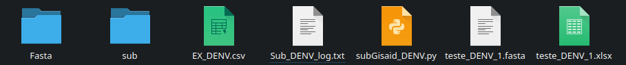

<details open>
  <summary>README</summary>
  
  ## GISAID Submission Method
  
  This repository contains scripts for the GISAID submission of Influenza viruses (H1N1, H3N2, Vic/Yamagata), Dengue (DENV), and SARS-CoV (COV).
  
  ### Files in the Code Folder
  
  You can download the desired script by navigating to the CODE tab and clicking the download button in the upper right corner.
  
  ## Usage and Installation Guide
  
  ### Requirements to Run the Script:
  - The script for the desired virus.
  - An edited CSV as provided in the example (if possible, edit the example file with your data).
  - Python 3.
  - Pandas and biopython
  
  ### Installation Steps:
  If you do not have Python or the required libraries, use the following commands:
  
  ```sh
  sudo apt-get update
  sudo apt-get install python3
  sudo apt-get install python3-pip python3-venv
  python3 -m venv myenv(name of your  virtual environment)
  source myenv/bin/activate
  myenv\Scripts\activate
  pip install pandas biopython openpyxl

  ```
  depois do ambinte ser criado uma pasta com o nome do ambite (no meu caso o nome é 'sub') vai ser criada tambem com todos os documentos necessario 
  
  
   
  
  Certifique que essas pasta foram criadas corretamentes
  You now have an environment to run the script. 
  um exemplo de como ativa o ambiente no terminal, no meu caso eu nomei o ambiente como 'sub'
  note que o nome do ambite fica do lado nome do usuario/nome do computador 
  to activate the environment before running it.
  
  
  
  Recommendations:

  Consistent Folder Usage: Always run the scripts in the same folder to ensure the log file is continuously updated. Running the script in a new folder will create a new log.

 Dedicated Folder: Create a dedicated folder to run the scripts. The script combines all FASTA files related to the CSV and outputs a final FASTA file. To prevent accidental deletion of the final FASTA, move it to a separate folder after generation. Since the script stores all intermediate FASTA files in the working folder and deletes     them after use, ALWAYS move the final files to a different folder (e.g., final_files) to ensure better code functionality and data safety.
 In the Supplementary_files folder, I have provided examples of CSV and FASTA files with the necessary columns to run each script. Using these tables, the script should work without any issues. Please fill in the data in these tables using the guide provided for each script as previously mentioned.

  For any questions or suggestions, please contact the CEVIVAS team or send an email to: iago.lima.esib@esib.butantan.br or iagottlima@gmail.com.
Windows option coming soon...

</details>
<details>
  <summary>README_FLU</summary>

This README provides an overview of the data columns and script requirements for the SG-FLU project.

   Data Columns

    ID: Sample ID
    Genome: The name of the FASTA file
    Type: Flu type (A or B)
    Subtype: The subtype of the flu (H1N1, H3N2, Victoria, or Yamagata)
    REQUESTING_STATE: Your state
    Segment_1_Coverage: Coverage of segment 1
    Segment_2_Coverage: Coverage of segment 2
    Segment_3_Coverage: Coverage of segment 3
    Segment_4_Coverage: Coverage of segment 4
    Segment_5_Coverage: Coverage of segment 5
    Segment_6_Coverage: Coverage of segment 6
    Segment_7_Coverage: Coverage of segment 7
    Segment_8_Coverage: Coverage of segment 8
    REQUESTING_UNIT: Name of your unit
    Collection_Date: Collection date
    Authors: Name of the authors (please follow the example)
  Script Arguments
  
    
    --input: The CSV file with your data
    --output: Name of the output file
    --D: Number of the dynamic
    --fasta: Path to the folder with FASTA files
    --cover: Percentage of coverage of segments you want


    python3 subGisaid_FLU.py --input  --output  --D --fasta  --cover 

The output of the script includes one log file, one FASTA file with formatted headers, and one XLSX file ready for submission to GISAID.


NOTE: The header of the FASTA file NEEDS to be the SAME as the content in the Genome column. Please verify this.

Example: If the Genome column contains "EPI_ISL_00097", the FASTA header should be "EPI_ISL_00097".


</details>

<details>
  <summary>README_COV</summary>
Explanations

This README provides an overview of the data columns and script requirements for the SG-COV project.
Data Columns

    ID: Sample ID
    Genome: The name of the FASTA file
    Pangolin_lineage: Lineage of pangolin
    Clade: Number of the clade
    REQUESTING_UNIT: The name of your laboratory
    State: Your state
    Abbreviations: Abbreviation of your state
    Collection_Date: Collection date
    REQUESTING_SEQ: Laboratory that sequenced the sample
    Authors: Names of the authors (please follow the example)
    Country: Your country
    Continent: Your continent
    
  Script Arguments
  
    --input: The CSV file with your data
    --output: Name of the output file
    --D: Number of the dynamic
    --fasta: Path to the folder with FASTA files
    --cover: Percentage of coverage of segments you want


    python3 subGisaid_FLU.py --input  --output  --D --fasta 

The output of the script includes one log file, one FASTA file with formatted headers, and one XLSX file ready for submission to GISAID.


NOTE: The header of the FASTA file NEEDS to be the SAME as the content in the Genome column. Please verify this.

Example: If the Genome column contains "EPI_ISL_00097", the FASTA header should be "EPI_ISL_00097".


</details>


<details>
  <summary>README_DENV</summary>
  SG-DENV README
Explanations

This README provides an overview of the data columns and script requirements for the SG-DENV project.
Data Columns

    ID: Sample ID
    Genome: The name of the FASTA file
    Serotype: The serotype of the sample
    Genotype: The genotype of the sample
    REQUESTING_UNIT: The name of partner laboratories (if not applicable, put the name of your lab)
    State: Your state
    Abbreviations: Abbreviation of your state
    Collection_Date: Collection date
    REQUESTING_SEQ: Laboratory that sequenced the sample
    Authors: Names of the authors (please follow the example)
    Country: Your country
    Continent: Your continent

  Script Arguments
  
    
    --input: The CSV file with your data
    --output: Name of the output file
    --D: Number of the dynamic
    --fasta: Path to the folder with FASTA files
    --cover: Percentage of coverage of segments you want


    python3 subGisaid_DENV.py --input  --output  --D --fasta  

The output of the script includes one log file, one FASTA file with formatted headers, and one XLSX file ready for submission to GISAID.




NOTE: The header of the FASTA file NEEDS to be the SAME as the content in the Genome column. Please verify this.

Example: If the Genome column contains "EPI_ISL_00097", the FASTA header should be "EPI_ISL_00097".


</details>
